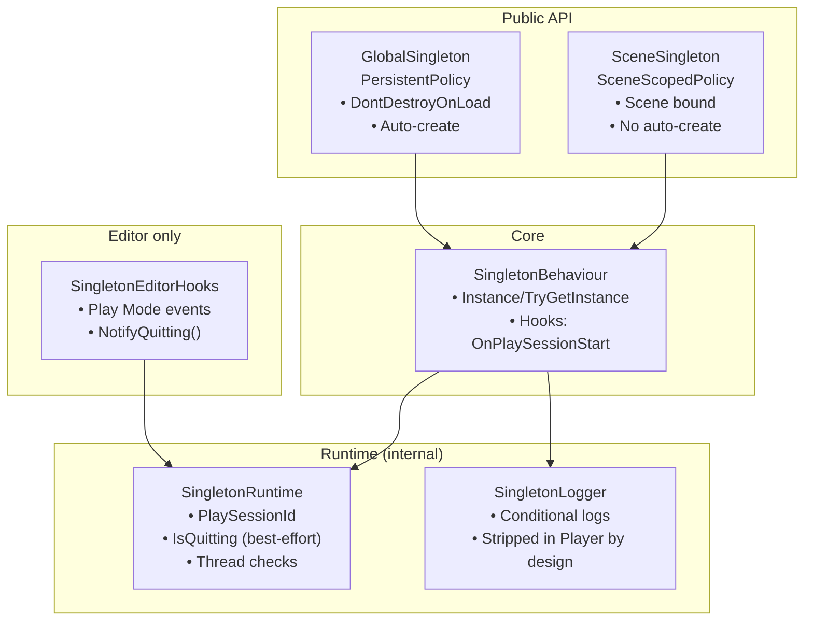
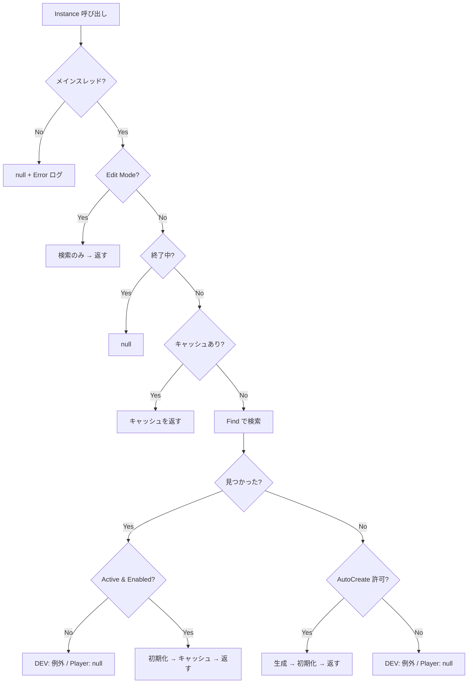
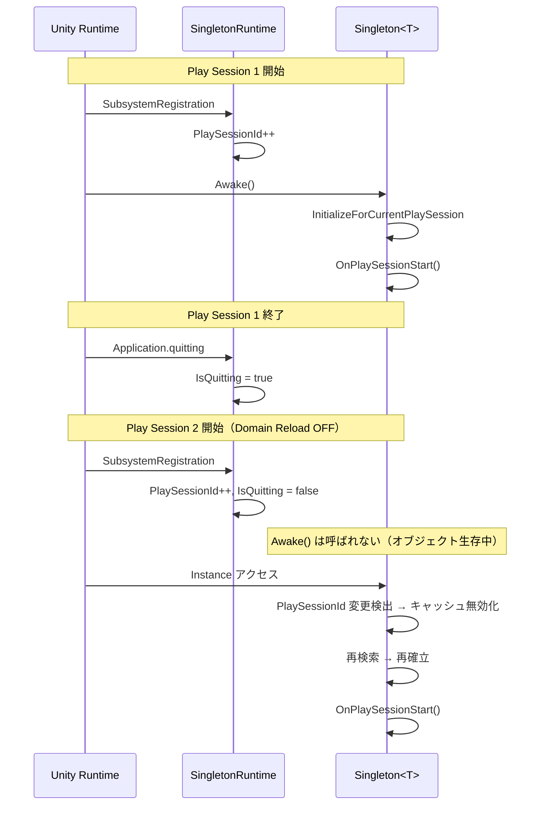

<div align="center">

# 🧩 PolicyDrivenSingleton

**MonoBehaviour向けのポリシー駆動型シングルトン基底クラス（Domain Reload ON/OFF 両対応）**

[Features](#features) •
[Requirements](#requirements) •
[Installation](#installation) •
[Quick Start](#quick-start) •
[API](#api-cheat-sheet) •
[Architecture](#architecture) •
[Constraints](#constraints--best-practices) •
[Limitations](#known-limitations) •
[Debug](#debug-logging) •
[Troubleshooting](#troubleshooting) •
[References](#references)


</div>

---

## Overview

**PolicyDrivenSingleton** は、MonoBehaviour向けの **ポリシー駆動型シングルトン基底クラス**です。

- **`GlobalSingleton<T>`**：シーン間永続 + 見つからなければ自動生成
- **`SceneSingleton<T>`**：シーンスコープ + 自動生成しない（シーン配置必須）

Enter Play Mode Options の **Reload Domain を無効化**して static が Play 間で残る環境でも、**Playセッション境界**で確実にキャッシュを無効化し、再探索・再初期化できるように設計しています。

### When to Use / Consider Alternatives

| ✅ 本ライブラリが適している場合 | 💡 代替を検討すべき場合 |
|-------------------------------|------------------------|
| 常駐マネージャ（Audio, Input, Game など） | テスト容易性を重視 → DI コンテナ（Zenject, VContainer 等） |
| シーン内コントローラ（Level, UI など） | データ駆動設計を好む → ScriptableObject ベースのサービスロケータ |
| Domain Reload OFF 環境での安定動作が必要 | 小規模・プロトタイプ → `FindAnyObjectByType` を都度呼ぶ運用 |
| 明示的なライフサイクル制御が必要 | 状態を持たない処理 → 静的クラスで十分 |

---

## Features

<table>
<tr>
<td width="50%">

### 🎯 Core

- **ポリシー駆動**：永続化 / 自動生成の挙動をポリシーで分離
- **2種類の提供クラス**：Global / Scene
- **厳密な型一致**：`T` と実体型が一致しない参照は拒否

</td>
<td width="50%">

### 🛡️ Robustness

- **Domain Reload OFF 対応**：PlayセッションIDで static キャッシュを無効化
- **終了処理ガード（ベストエフォート）**：終了中の復活（resurrection）を抑制
- **Edit Mode 副作用ゼロ**：検索のみ・生成しない・staticキャッシュ更新しない

</td>
</tr>
<tr>
<td width="50%">

### ⚡ Performance

- **ポリシー解決はゼロアロケ**（readonly struct + default）
- **検索は FindAnyObjectByType を使用**
- **頻繁アクセスはキャッシュ推奨**

</td>
<td width="50%">

### 🧰 Dev Experience

- **DEV/EDITOR/ASSERTIONS では fail-fast**（誤用を早期検出）
- **Playerビルドは strip 前提**：検証/ログは `[Conditional]` で除去され、fail-soft（null/false）になり得る
- **PlayMode/EditMode テスト同梱**（運用状況に応じて更新）

</td>
</tr>
</table>

---

## Requirements

| 項目 | 要件 |
|---|---|
| Unity | **2022.3+**（Unity 6.3でテスト済み） |
| Enter Play Mode Options | **Reload Domain ON/OFF 両対応** |
| 外部依存 | なし |

---

## Installation

### Option A: Manual Copy（推奨）

1. `PolicyDrivenSingleton/` フォルダを任意の場所へコピー
   例：`Assets/Plugins/PolicyDrivenSingleton/`
2. 必要なら asmdef 名や namespace をプロジェクト方針に合わせて調整

> NOTE: 参照（Prefab/Scene等）まで含む配布を想定する場合は `.meta` の扱いを運用として定義してください（「コード断片共有」なら不要）。

### Option B: Git で取り込み（任意）

- submodule / subtree 等で `PolicyDrivenSingleton/` を取り込む運用も可能です
  （このリポジトリは UPM 前提ではありません）

---

## Quick Start

### 1) GlobalSingleton（永続 + 自動生成）

```csharp
using PolicyDrivenSingleton;

// 継承禁止 (sealed) を推奨します
public sealed class GameManager : GlobalSingleton<GameManager>
{
    protected override void Awake()
    {
        base.Awake(); // 必須 - シングルトンを初期化します
        // 初回のみの初期化
    }

    protected override void OnPlaySessionStart()
    {
        // Playセッションごとの再初期化（Domain Reload OFF を含む）
        // 例：一時データ、イベント購読、キャッシュの再構築
    }
}

// 利用例:
// GameManager.Instance.AddScore(10);
```

### 2) SceneSingleton（シーンスコープ + 自動生成なし）

```csharp
using PolicyDrivenSingleton;

public sealed class LevelController : SceneSingleton<LevelController>
{
    protected override void Awake()
    {
        base.Awake(); // 必須
    }
}

// ⚠️ シーン配置必須（置き忘れは DEV/EDITOR/ASSERTIONS で fail-fast）
```

### 3) 毎フレームアクセスは避け、キャッシュする

```csharp
private GameManager _gm;

private void Awake()
{
    _gm = GameManager.Instance; // 起動時に確立してキャッシュ
}

private void Update()
{
    if (_gm == null) return; // fail-soft 構成の保険
    // ...
}
```

---

## API Cheat Sheet

### Public surface

| API                          | 目的               |                 自動生成 | 典型用途                     |
| ---------------------------- | ---------------- | -------------------: | ------------------------ |
| `T Instance { get; }`        | 必須経路で確立する        | Global: ✅ / Scene: ❌ | 起動・初期化・ゲーム進行必須           |
| `bool TryGetInstance(out T)` | “あるなら使う”安全経路     |                    ❌ | 後片付け、解除、終了/中断経路          |
| `OnPlaySessionStart()`       | Playセッションごとの再初期化 |                    - | Domain Reload OFF 対策、再購読 |

### Instance / TryGet の挙動（要点）

| 状態        | `Instance`                    | `TryGetInstance` |
| --------- | ----------------------------- | ---------------- |
| Play 中    | 確立済みなら返す / 必要なら検索・（Globalは）生成 | 存在すれば返す（生成しない）   |
| 終了処理中     | `null`                        | `false`          |
| Edit Mode | 検索のみ（生成しない・キャッシュ更新しない）        | 検索のみ（キャッシュ更新しない） |

> 推奨：解除系（OnDisable/OnDestroy/OnApplicationPause等）は `TryGetInstance` を原則にする。

<details>
<summary><strong>fail-fast / fail-soft の方針（詳細）</strong></summary>

* **DEV/EDITOR/ASSERTIONS**：誤用を早期に発見するため、以下は fail-fast（例外）になり得ます。

  * 非アクティブなシングルトン検出（検索APIがinactiveを既定で見ないため、隠れ重複に繋がる）
  * SceneSingleton の置き忘れ（自動生成しない契約）
* **Player**：検証やログは `[Conditional]` 等でストリップされる前提のため、fail-soft（`null` / `false`）になり得ます。
* したがって利用側は `null` / `false` を前提にハンドリングしてください（特に解除/終了経路）。

</details>

<details>
<summary><strong>API Quick Reference（状態別の詳細）</strong></summary>

#### `T Instance { get; }` の振る舞い

| 状態 | GlobalSingleton | SceneSingleton |
|------|-----------------|----------------|
| **Play中（正常）** | キャッシュ済み → 返す / なければ検索 → 自動生成 | キャッシュ済み → 返す / なければ検索のみ |
| **終了処理中** | `null` | `null` |
| **Edit Mode** | 検索のみ（生成・キャッシュ更新なし） | 検索のみ |
| **非アクティブ検出** | DEV: 例外 / Player: `null` | DEV: 例外 / Player: `null` |
| **シーン未配置** | 自動生成 | DEV: 例外 / Player: `null` |
| **型不一致** | 拒否（DEV: Error ログ → 破棄） | 拒否（DEV: Error ログ → 破棄） |
| **バックグラウンドスレッド** | `null`（Error ログ出力） | `null`（Error ログ出力） |

#### `bool TryGetInstance(out T)` の振る舞い

| 状態 | 振る舞い |
|------|----------|
| **存在する** | `true` + 有効な参照 |
| **存在しない** | `false` + `null`（**自動生成しない**） |
| **終了処理中** | `false` + `null` |
| **Edit Mode** | 検索のみ（キャッシュ更新しない） |
| **非アクティブ検出** | DEV: 例外 / Player: `false` + `null` |
| **バックグラウンドスレッド** | `false` + `null`（Error ログ出力） |

#### `OnPlaySessionStart()` の呼び出しタイミング

| 条件 | 呼び出し |
|------|----------|
| **初回 Play（Domain Reload ON）** | `Awake()` → `OnPlaySessionStart()` |
| **2回目以降 Play（Domain Reload OFF）** | `OnPlaySessionStart()` のみ（`Awake()` は呼ばれない） |
| **シングルトン確立時** | 1 Play セッションにつき 1 回のみ |

</details>

---

## Architecture



**Notes:**
- **Editor hooks の方向**: `SingletonEditorHooks`（Editor専用）が `SingletonRuntime.NotifyQuitting()` を呼び出す。ランタイムコードは Editor フックに依存しない
- **internal クラス**: `SingletonRuntime` / `SingletonLogger` は `internal` であり、外部から直接呼び出し不可

### Design intent（要約）

* **Domain Reload OFF でも安全**：Playセッション開始ごとに `PlaySessionId` を更新し、型ごとの static キャッシュを無効化 → 再探索して同一インスタンスを掴み直す
* **Edit Mode 副作用ゼロ**：エディタ拡張から呼んでも生成やキャッシュ更新を行わない
* **検索仕様に合わせた防御**：Find系APIは既定で inactive を対象外にするため、非アクティブなシングルトンは「存在しても見つからない扱い → 自動生成 → 隠れ重複」になり得る。DEV/EDITOR/ASSERTIONS では強く検出する

<details>
<summary><strong>Instance 取得フロー（図解）</strong></summary>



</details>

<details>
<summary><strong>Play Session 境界のライフサイクル（Domain Reload OFF）</strong></summary>



</details>

---

## Directory Structure

```text
PolicyDrivenSingleton/
├── Core/
│   ├── AssemblyInfo.cs                                  # InternalsVisibleTo（テスト用）
│   ├── SingletonBehaviour.cs                            # コア実装
│   ├── SingletonLogger.cs                               # 条件付きロガー（Playerビルドで除去）
│   └── SingletonRuntime.cs                              # 内部ランタイム（Domain Reload対策）
├── Editor/
│   ├── SingletonEditorHooks.cs                          # Editorイベントフック（Play Mode状態）
│   └── PolicyDrivenSingleton.Editor.asmdef              # Editor用 asmdef
├── Policy/
│   ├── ISingletonPolicy.cs                              # ポリシーインターフェース
│   ├── PersistentPolicy.cs                              # 永続ポリシー
│   └── SceneScopedPolicy.cs                             # シーンスコープポリシー
├── Tests/                                               # PlayMode & EditMode テスト
│   ├── Editor/
│   │   ├── PolicyDrivenSingletonEditorTests.cs          # EditMode テスト
│   │   └── PolicyDrivenSingleton.Editor.Tests.asmdef
│   ├── Runtime/
│   │   ├── PolicyDrivenSingletonRuntimeTests.cs         # PlayMode テスト
│   │   └── PolicyDrivenSingleton.Tests.asmdef
│   └── TestExtensions.cs                                # テスト用ヘルパー
├── GlobalSingleton.cs                                   # Public API（永続・自動生成あり）
├── SceneSingleton.cs                                    # Public API（シーン限定・自動生成なし）
└── PolicyDrivenSingleton.asmdef                         # Runtime asmdef
```

---

## Constraints & Best Practices

### 意図的な契約（破ると事故る）

* **Play中はメインスレッド前提**（Unity APIを呼ぶため）
* **厳密な型一致**：派生型など `T` と一致しない参照は拒否
* **SceneSingleton はシーン配置必須**（自動生成しない）
* **Inactive/Disabled運用は避ける**（隠れ重複の原因）
* **終了中の復活を避ける**：終了経路は `TryGetInstance` を使う（`Application.quitting` はベストエフォート）

### 実装側の推奨

* 具象クラスは `sealed` 推奨（型不一致/拡張の事故を避ける）
* `Awake/OnEnable/OnDestroy` を override する場合は **base 呼び出し必須**
* 頻繁アクセスする参照はキャッシュする（Updateで `Instance` を叩かない）
* **GlobalSingleton は root GameObject 推奨**：`DontDestroyOnLoad` は root にのみ有効。子オブジェクトの場合、本ライブラリが自動で root へ移動し Warning を出力

---

## Advanced Topics

### Playセッション境界の再初期化（Soft Reset）

Domain Reload OFF 環境では static 状態が残ります。**Awake は生存期間中1回**のため、Playごとの再初期化は `OnPlaySessionStart()` で行ってください。

* `OnPlaySessionStart()` は **冪等**に書く（イベント購読は「解除 → 登録」など）

### Initialization Order（任意）

初期化順序を厳密に制御したい場合は `DefaultExecutionOrder` や Bootstrap で固定してください。

```csharp
using UnityEngine;
using PolicyDrivenSingleton;

[DefaultExecutionOrder(-10000)]
public class Bootstrap : MonoBehaviour
{
    void Awake()
    {
        _ = GameManager.Instance;
        _ = AudioManager.Instance;
        _ = InputManager.Instance;
    }
}
```

<details>
<summary><strong>Unity API前提（要点）</strong></summary>

* Domain Reload 無効：static フィールドと static event の購読が Play 間で残る
* Find系：既定で inactive は除外される／呼び出しごとに同一オブジェクトが返る保証はない
* DontDestroyOnLoad：root GameObject（またはroot上のComponent）に対してのみ有効
* Application.quitting：強制終了やクラッシュ等では発火しない場合がある／キャンセルできない局面で発火する

</details>

---

## Known Limitations

| 制限事項 | 説明 | 回避策 |
|----------|------|--------|
| **静的コンストラクタのタイミング** | シングルトンクラスに静的コンストラクタがあると `PlaySessionId` 初期化前に実行される可能性 | 静的コンストラクタを避ける、または遅延初期化パターンを使用 |
| **スレッドセーフティ** | すべての操作はメインスレッドから呼び出す必要がある | バックグラウンド処理の結果は `UnityMainThreadDispatcher` 等でメインスレッドに戻す |
| **シーン読み込み順序** | 複数シーンに同一シングルトン型がある場合、破棄順序は Unity のシーン読み込み順序に依存 | シングルトンは 1 シーンにのみ配置する |
| **メモリリーク（Domain Reload OFF）** | `OnDestroy` で静的イベント購読を解除しないとリークする | `OnPlaySessionStart` で「解除 → 登録」パターンを使う |
| **Find API の非決定性** | `FindAnyObjectByType` は呼び出しごとに同一オブジェクトを返す保証がない | 本ライブラリはキャッシュで吸収済み（利用側は意識不要） |
| **Inactive の検出漏れ** | `FindAnyObjectByType(Exclude)` は非アクティブを見ない | シングルトンは常に Active にする。DEV では fail-fast で検出 |

---

## Testing

PlayMode / EditMode テスト同梱（合計 **74 テスト**：PlayMode 53 / EditMode 21）

**実行方法**：Window → General → Test Runner → Run All

<details>
<summary><strong>テストカバレッジ詳細</strong></summary>

#### PlayMode テスト（53個）

| カテゴリ | テスト数 | カバレッジ |
|----------|----------|------------|
| GlobalSingleton | 7 | 自動生成、キャッシュ、重複検出 |
| SceneSingleton | 5 | 配置、自動生成なし、重複検出 |
| InactiveInstance | 3 | 非アクティブGameObject検出、無効コンポーネント |
| TypeMismatch | 2 | 派生クラス拒否 |
| ThreadSafety | 7 | バックグラウンドスレッド保護、メインスレッド検証 |
| Lifecycle | 2 | 破棄、再生成 |
| SoftReset | 1 | PlaySessionId 境界での Playごとの再初期化 |
| SceneSingletonEdgeCase | 2 | 未配置、自動生成なし |
| PracticalUsage | 6 | GameManager、LevelController、状態管理 |
| PolicyBehavior | 3 | ポリシー駆動挙動検証 |
| ResourceManagement | 3 | インスタンスライフサイクルとクリーンアップ |
| DomainReload | 6 | PlaySessionId境界、キャッシュ無効化、終了状態 |
| ParentHierarchy | 2 | DontDestroyOnLoad用のルート再配置 |
| BaseAwakeEnforcement | 1 | base.Awake() 呼び出し検出 |
| EdgeCase | 3 | 破棄インスタンスクリーンアップ、高速アクセス、配置タイミング |

#### EditMode テスト（21個）

| カテゴリ | テスト数 | カバレッジ |
|----------|----------|------------|
| SingletonRuntimeEditMode | 2 | PlaySessionId、IsQuitting 検証 |
| Policy | 5 | Policy struct 検証、不変性、インターフェース準拠 |
| SingletonBehaviourEditMode | 5 | EditMode 挙動、キャッシュ分離 |
| SingletonLifecycleEditMode | 3 | 親階層、生成、Edit Modeでの共存 |
| SingletonRuntimeStateEditMode | 2 | NotifyQuitting、PlaySessionId一貫性 |
| SingletonLoggerEditMode | 4 | Log、LogWarning、LogError、ThrowInvalidOperation API |

</details>

---

## Debug Logging

ライブラリは以下のシンボルのいずれかが定義されている場合にデバッグログを出力します。それ以外では `[Conditional]` によりストリップされます。

- `UNITY_EDITOR`
- `DEVELOPMENT_BUILD`
- `UNITY_ASSERTIONS`

### 出力されるログ一覧

| レベル | メッセージ | トリガー |
|--------|----------|----------|
| **Log** | `OnPlaySessionStart invoked.` | シングルトンのセッション初期化実行時 |
| **Log** | `Instance access blocked: application is quitting.` | 終了中に `Instance` アクセス |
| **Log** | `TryGetInstance blocked: application is quitting.` | 終了中に `TryGetInstance` アクセス |
| **Warning** | `Auto-created.` | GlobalSingleton の自動生成 |
| **Warning** | `Duplicate detected. Existing='...', destroying '...'` | 重複シングルトンの検出・破棄 |
| **Warning** | `Reparented to root for DontDestroyOnLoad.` | 永続化のため子オブジェクトをルートへ移動 |
| **Error** | `base.Awake() was not called in ...` | サブクラスで `base.Awake()` 呼び出し忘れ |
| **Error** | `Type mismatch. Expected='...', Actual='...'` | 型不一致検出（派生型など） |
| **Error** | `... must be called from the main thread.` | バックグラウンドスレッドからのアクセス |

### デバッグ用コードスニペット

```csharp
// シングルトンの状態確認
if (MySingleton.TryGetInstance(out var instance))
{
    Debug.Log($"Singleton found: {instance.name}");
}
else
{
    Debug.LogWarning("Singleton not available");
}
```

---

## Troubleshooting

### まず見るチェックリスト

* コンポーネントが **Active & Enabled** か？
* Play中に **メインスレッド** から呼んでいるか？
* `Awake` override 時に `base.Awake()` を呼んでいるか？
* SceneSingleton をシーンに置き忘れていないか？

<details>
<summary><strong>FAQ</strong></summary>

**Q. Play Modeで `Instance` が null を返す**

A. Active/Enabled、メインスレッド、base呼び出し、終了中ガードのいずれかを確認してください。

**Q. 重複が検出される / 破棄される**

A. 複数シーン・プレハブに同一型が混在している可能性があります。配置を整理してください。

**Q. 例外が出る環境と出ない環境がある**

A. DEV/EDITOR/ASSERTIONS の fail-fast と、Playerの fail-soft の差です。解除・後片付けは `TryGetInstance` を使ってください。

</details>

---

## References

| トピック | リンク |
|----------|--------|
| GitHub Docs: Creating Mermaid diagrams | [docs.github.com](https://docs.github.com/en/get-started/writing-on-github/working-with-advanced-formatting/creating-diagrams) |
| Unity Manual: Domain Reloading | [docs.unity3d.com](https://docs.unity3d.com/6000.3/Documentation/Manual/domain-reloading.html) |
| Unity API: Object.FindAnyObjectByType | [docs.unity3d.com](https://docs.unity3d.com/6000.3/Documentation/ScriptReference/Object.FindAnyObjectByType.html) |
| Unity API: FindObjectsInactive | [docs.unity3d.com](https://docs.unity3d.com/6000.3/Documentation/ScriptReference/FindObjectsInactive.html) |
| Unity API: Object.DontDestroyOnLoad | [docs.unity3d.com](https://docs.unity3d.com/6000.3/Documentation/ScriptReference/Object.DontDestroyOnLoad.html) |
| Unity API: Application.quitting | [docs.unity3d.com](https://docs.unity3d.com/6000.3/Documentation/ScriptReference/Application-quitting.html) |
| Unity API: DefaultExecutionOrder | [docs.unity3d.com](https://docs.unity3d.com/6000.3/Documentation/ScriptReference/DefaultExecutionOrder.html) |
| Microsoft Docs: ConditionalAttribute | [learn.microsoft.com](https://learn.microsoft.com/dotnet/api/system.diagnostics.conditionalattribute) |

---

## License

MIT License. See [LICENSE](./LICENSE).
